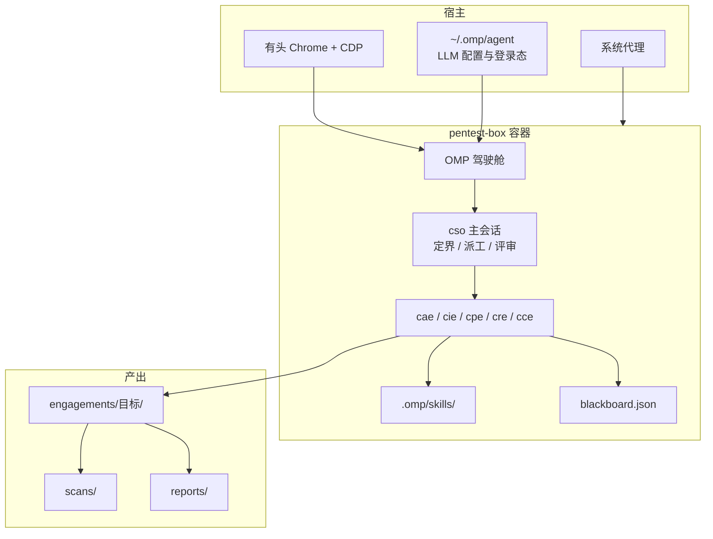

## 1. 背景

暑期实习时我搭建了这一个自用渗透工作台，缝合了挺多的东西，但十分有效。

一开始我寻求开源社区的“渗透Agent”现成方案，但却不尽如我意。我尝试了**Strix**，它的架构不错，但是Python写的，运行起来实在太卡了，而且缺少很多Agent应有的功能（比方说不能主动压缩导致非常烧Token，打断也比较麻烦），我喜欢它的思路，但它的架构让微调实在太麻烦了。

于是我搭了 [pentest-box](https://github.com/Liushenwuzhu-Alpaca/pentest-box)：以 Kali 攻击工具链为执行层，以 OMP 为驾驶舱，再叠一层多专家子代理与黑板协调，并使用开源社区搜罗的各种渗透技能。

---

## 2. 总体架构



三层分工：

| 层 | 职责 | 形态 |
|---|---|---|
| 执行层 | 跑 nmap / httpx / sqlmap / nuclei 等 | Kali 系容器 + 工具链 |
| 驾驶舱 | 会话、子代理、技能加载、浏览器工具 | OMP |
| 编排层 | 角色分域、黑板、评审门、覆盖治理 | `AGENTS.md` + agents + skills + 黑板 CLI |

渗透产出统一进 `engagements/<目标>/`：`scans/` 放大体积原始输出，`reports/` 放可交付报告，黑板状态与 engagement 同目录。

---

## 3. 容器基座：把「能跑」做成「能长期用」

镜像以攻击工具链为基座，工作目录挂载到 `/work`。真正决定能不能天天用的，是几条工程决策。

### 3.1 非 root 运行

容器默认用户是 `pentester`（uid 1000，与常见宿主用户对齐），sudo 免密。写入 `/work` 的文件在主机上属于当前用户，如果默认root用户则跑完会在主机上出现一地必须用root权限才能操作的垃圾。

需要原始套接字的操作（如 `nmap -sS`、masscan、抓包）显式加 `sudo`，边界清晰。

### 3.2 `run-box.sh`：代理透传

宿主若设了 `http_proxy` / `https_proxy` / `all_proxy`，脚本会：

1. 把 URL 里的 `127.0.0.1` / `localhost` 改写成 `host.docker.internal`；
2. 以 `-e` 注入容器；
3. 给 `no_proxy` 自动补上 `host.docker.internal` 等。

### 3.3 `browser-host.sh`：宿主有头浏览器附着

容器内 OMP 的 browser 工具通过项目级配置附着宿主 Chrome 的 CDP 端口。登录态、JS 渲染、验证码人工点一下，都还能用真实浏览器。

### 3.4 单实例约束

`~/.omp/agent` 挂进容器是为了复用主机的 LLM 配置与登录态。**尽量不要同时跑两个挂载同一 agent 目录的 omp 实例**（sqlite 会话库并发写风险）。容器里跑 omp 时，主机上的最好先退出。

---

## 4. 技能库：可触发的方法论，不是提示词堆

技能目录里有上百个专项。来源大致两类：

1. **公开精选与迁移**：网络安全公开技能集、以及从 Strix 体系迁移过来的 `strix-*` 技能（SQLi、XSS、SSRF、IDOR、工具语法等）。
2. **按实战补的增强技能**：国内 OA / 国际 CMS 定向验证、备份与敏感路径发现、证据包固化、独立结果核验、业务逻辑与越权知识库、进阶 Web 绕过笔记、收尾与 preflight 等。

设计原则只有几条，但很硬：

- **先指纹再定向**，禁止无版本盲打；
- 技能带 `SKILL.md` + `references/`，能对照、能回源；
- 工具缺失**先上报、再安装**，不静默改环境；
- 试错型向量（SQLi / XSS / SSRF 等）优先脚本批量喷洒，再挑异常做人工验证。

技能多不等于能用。中间做过一轮**质量治理**：把不可执行的文稿重写成通顺、可落地的方法论文档，清掉死引用和卫生问题。对外交付的是「能照着做」的技能，不是「看起来很长」的 markdown。

---

## 5. 多代理编排：cso 不亲自打洞

来自[玄幕](https://github.com/guaidao2/XuanMu-RedTeam-Agent)的角色迁移。

主会话扮演 **cso（编排者）**：读范围、拆目标、按域派专家、过评审门、维护覆盖、汇总报告。需要触碰目标就派子代理；主会话自己不跑扫描器、不发注入 payload。

| 代号 | 职责 | 典型触发 |
|---|---|---|
| cae | 代码审计、SAST、认证/注入溯源 | 有源码或要追根 |
| cie | OSINT、资产与指纹、关系扩展 | 新目标建攻击面 |
| cpe | 活体测试、PoC 证实/证伪 | 有可访问服务 |
| cre | 二进制 / 固件 / 协议逆向 | 样本与伪代码 |
| cce | 密码、协议、密钥与签名 | 加密 blob、JWT、PKI |

纪律：

- **一代理一任务**，子代理不要多任务一起做导致注意力涣散；
- **任务书自包含**，子代理看不到主会话，范围、非目标、已有线索、产出路径都要写进任务书；
- **动作风险分级 T0–T3**：被动情报可以直接派；利用尝试必须有明确意图；后渗透与高影响动作证据标准更严，且要独立验证。

漏洞工作流固定走三段链：

```
发现代理 → 独立验证代理（发现者不得自证）→ 报告代理
```

Critical / RCE 一类结论，再过结果核验门。合法结局有三种：**无发现**、**验证失败（误报排除）**、**确认漏洞**——前两种同样要记，不硬报。

---

## 6. 黑板：多代理并行时的唯一协调面

并行时不能靠「大家都记得聊天里说过什么」。黑板是跨代理的共享推理图，节点三类：

- **Intent**：打算探什么方向；
- **Fact**：已经确认的发现（必须挂到促成它的 Intent）；
- **Hint**：人工指导，创建后不流转。

状态机：`proposed → in_progress → confirmed | rejected | superseded`。死路应该标 rejected。

每个目标一份 `engagements/<目标>/blackboard.json`，写操作走 CLI（文件锁 + 原子替换），禁止手改 JSON。

---

## 7. 覆盖治理

「扫过了」和「覆盖完了」不是一回事。每个范围内资产只能处于一种状态，例如：

`covered / active / queued / blocked / deferred / thin / out of scope`

其中 **thin** 很关键：只抽了常见口、深扫和 HTTP 认领还没做，**不得当 covered**。禁止用「下线」代替 blocked/thin；只有全端口（或已触发的深扫）加多路径证据一致无 listener，才能结「无 Web 面」。

评审门是 **failure-seeking** 的：每次子代理返回后，对照用户要求逐项标 satisfied / incomplete / blocked……证据薄、仅抽样、未验证的，一律 incomplete。端口覆盖是硬项：范围内每个 IP 有没有扫口证据？常见口全失败有没有触发深扫？每个 open 口有没有 HTTP(S) 认领？任一否就继续派，不收场。

新线索出现时做关联：凭据/token 触发访问复测，端点/对象 id 触发越权复测，版本号触发已知面审查。专家说「blocked until X」，就把 X 存成复测触发器——X 出现就定向跟进，而不是让旧失败沉底。

---

## 8. 一条最小工程闭环

搭完骨架后，一次干净任务大致是：

1. 定界：目标、授权、明确非目标；
2. `engagements/<目标>/` 建工作区，初始化黑板；
3. cie 建攻击面（资产、端口、指纹），结果写 Fact；
4. cpe 按优先级验证（IDOR / SQLi / SSRF / XSS …），独立验证代理复现；
5. 确认项固化证据目录（请求/响应 raw、meta、必要时截图）；
6. wrap-up：自包含报告、覆盖板收口、残留面与风险定性。


---

## 9. 边界：做什么，不做什么

**做：**

- 授权范围内的侦察、验证、留证、收尾；
- 多工具交叉，扫描器结论必须 PoC 复现；
- 白盒场景尽量给到代码级修复建议。

**不做：**

- 无授权扫描与范围外扩展；
- 把模型幻觉或扫描器输出直接当结论；
- 为了「自动化」牺牲独立验证与覆盖治理。

已知限制也如实说：部分工具镜像里没有，按需安装；上游方法论文档更新后要手动同步；容器默认 `--rm`，装过的工具用完即丢——要长期用就进 Dockerfile 重建。

---


## 附录
| 路径 | 说明 |
|---|---|
| `.omp/AGENTS.md` | 编排者操作手册 |
| `.omp/agents/` | 五个专家子代理定义 |
| `.omp/skills/` | 渗透技能与黑板协议 |
| `engagements/<目标>/` | 单次任务工作区 |
| `run-box.sh` / `browser-host.sh` | 容器启动与宿主浏览器管理 |

仓库：[github.com/Liushenwuzhu-Alpaca/pentest-box](https://github.com/Liushenwuzhu-Alpaca/pentest-box)
