## 背景

进入 Coding Agent 时代之后，在 IDE 里按 Tab 补全已经成了“古法编程”，选一个趁手的 Agent 成了正经事。

你可能正在用的：

- **Claude Code、Codex** 这种已经风靡一时的 Agent（无论有没有用 GPT 或者 Claude，也许你已经习惯了外接 DeepSeek）。
- **Zcode、Kimi Code** 这种“模型专武”（已经购买了对应模型套餐）。
- **Opencode、Pi、DSH** 这种基座保证基本能力、社区驱动、扩展性强的开源 Agent（你应该花了挺多时间选插件，或者自己写插件并检查它们是否兼容）。

但你有没有对这些 Agent 感到过“千篇一律”？都在讲 Harness Engineering，功能用起来似乎大同小异；有的还喜欢对你在各家订阅之间的切换百般阻挠。你只是想要一个用起来顺手的 Agent，却已经为了各种额外配置付出了许多功夫。

如果你追求**开箱即用的优秀配置、新奇好用的功能，以及不受阻挠地在各家之间切换**，那或许该试一试 [Oh-My-Pi](https://omp.sh) 了。

## 介绍

我作为一个使用者，不来也懒得长篇大论它是怎么生的、有什么历史。光看名字就知道大概：Oh-My-Pi（下称 OMP）是 [Pi](https://github.com/badlogic/pi-mono) fork 出去的增强版，也是一个独特的发行版——TypeScript 写好界面与调度，Rust 扛下所有重活，MIT 协议，全线开源。

### TUI

首次启动 OMP，会引导你完成模型登录和 TUI 设置，之后见到的便是这个主页——美观、酷，又富含关键信息：

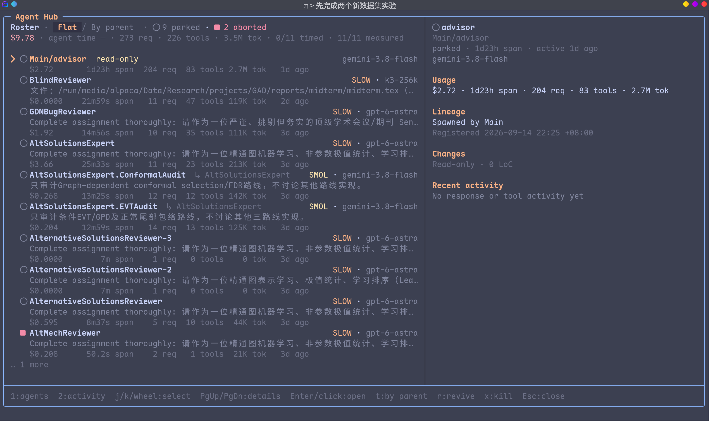

- **基本信息**：主页上可以看到模型、目录、Git 状态、LSP、最近对话、上下文使用、额度消耗等等。在根目录启动会自动重定向到 `/tmp`，跑一些一次性简单脚本时很方便。

- **请求信息**：每次请求 API，都直接显示时间戳、输入、输出、缓存、耗时、输出速率（为什么有的 Agent 要遮遮掩掩呢）。

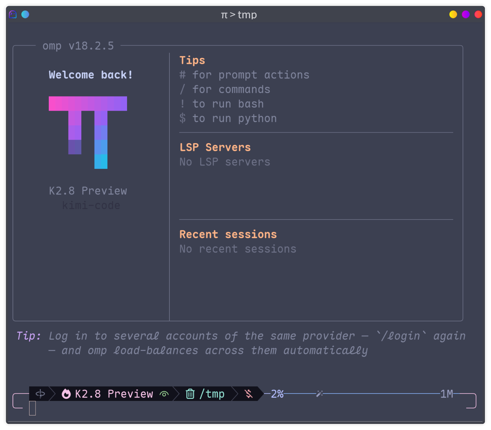

- **Hub**：`Ctrl+S` 或双击左方向键进入 Agent Hub，查看每个 Subagent 的状态、耗时与花费。

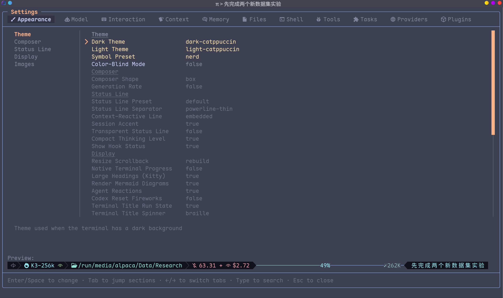

- **`/settings`**：进入设置，几乎你能想到的一切选项与功能都可以微调——光是主题就有八套，让它更顺手。

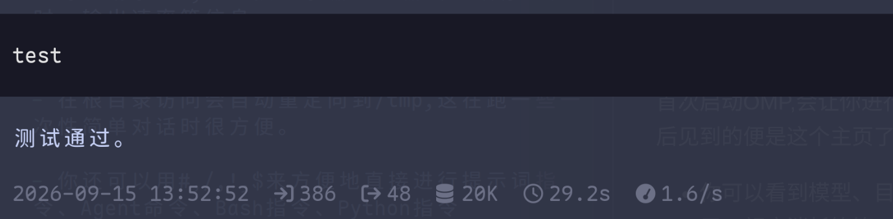

- **显示图片**：终端兼容 Kitty 图形协议的话，Agent 读图时图片会直接显示在终端里——它看什么，你也看什么。

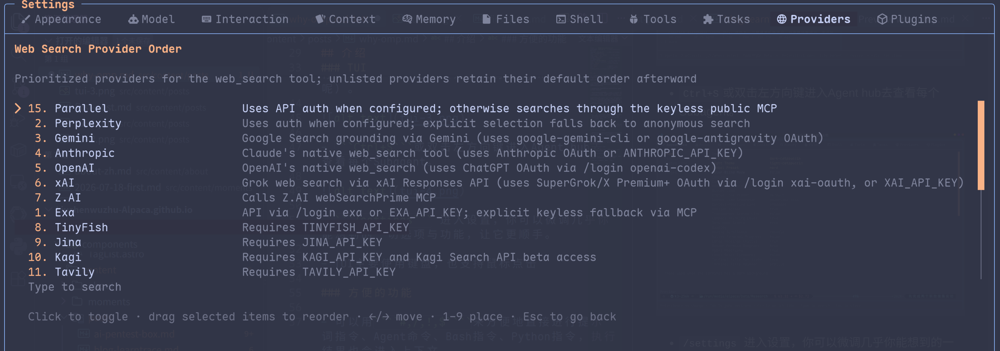

- **渲染表格、流程图、公式**：Markdown 的这些视觉效果都实时渲染，易于阅读。

- **操作**：TUI 主要用键盘，也支持鼠标点击。

- **Vim 模式**：设置里打开后，输入框就有了一套 Vim 键位——`Escape` 切 Normal，边框变色、光标变方块，该有的都在。

### 运行

- **工具**：`Rust` 原生工具集——grep、glob、find，乃至 sed、jq 都编译在进程内，调用没有 fork-exec 开销，Windows 上也不用先装一车 Unix 工具。

- **[哈希行编辑](https://blog.can.ac/2026/02/12/the-harness-problem/)**：先定位打哈希标、再编辑，相比传统的整段替换，编辑准确率明显提高（也可以换成别的编辑方式）。官方基准里，Grok 4 Fast 干同样的活省了 61% 的输出 Token。

- **运行时**：内嵌持久化的 `Python`、`JavaScript(Bun)`、`Bash` 内核，直接运行它们的代码——再也不用在你的 Windows 上和 PowerShell 打架。

- **长时间命令**：需要跑很久的命令直接挂到后台，不阻塞干等；正在跑的命令遇到新消息，也会自动转入后台继续跑。

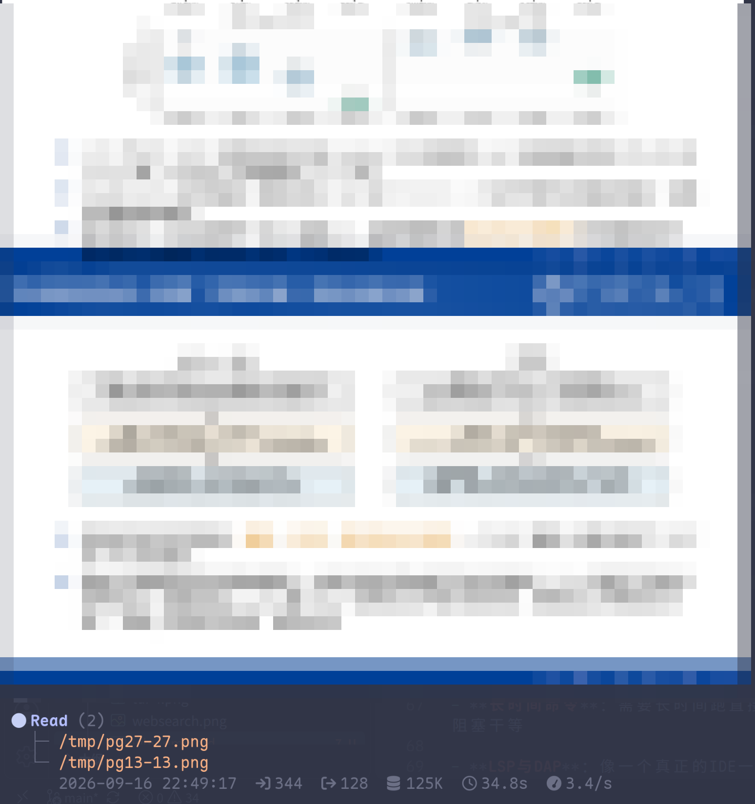

- **LSP 与 DAP**：像一个真正的 IDE——能用 LSP 诊断、重命名、格式化，也能用 DAP 打断点调试（嫌它们占工具上下文，也可以随手关掉）。

- **Subagent**：可嵌套两层委派 Subagent，并发不会串行阻塞，运行时还能互相通话。

- **AST 改写**：`ast_edit` 做结构化 codemod——按语法树匹配而不是按文本，改动先出预览卡片，确认后原子落地，要么全成、要么不动。

- **流式纠偏**：流规则（TTSR）平时休眠不占上下文，模型一旦跑偏被正则命中，流当场中断、规则作为系统提醒注入、从原点重试——纠偏不用在每轮白付上下文税，压缩之后也还在。

- **内部协议**：`pr://`、`issue://`、`agent://`、`skill://`、`ssh://`……十六种内部 scheme 在所有文件类工具里通用，`read pr://1428` 和 `read src/foo.ts` 是一个姿势——GitHub 不过是另一个文件系统。

### 指令

- **方便指令**：可以用 `#`、`/`、`!`、`$` 分别直接进行提示词指令、Agent 命令、Bash 指令、Python 指令，执行结果也会进入上下文。

- **[/compact](https://github.com/can1357/oh-my-pi/blob/main/docs/compaction.md)**：使用视觉可用的模型时，可设置优先用 `snapcompact` 把上下文瞬间压成图片——相比传统总结不丢失任何上下文；GPT 和 Claude 的思维链不完整，更推荐使用端侧压缩。

- **[/prewalk](https://github.com/can1357/oh-my-pi/blob/main/docs/prewalk.md)**：先让强模型探仓库、立计划，再让执行的小模型直接继承上下文开写。

- **/advisor**：放一个模型在主进程边上，一直盯着有没有跑偏（推荐小模型），随时给出提醒。多一个视角就是多一分准确率。

- **/tan**：把支线任务连同当前上下文一起丢给后台 Agent 去跑，主进程继续干正事。

- **/live**：语音输入，可以走 Codex 的接口，也可以用本地下载的语音小模型。

- **/vibe**：一种 Subagent 组织方式——主进程变成 Viber，不直接编辑与执行，只通过提示词委派两类 Subagent 操作。

- **/tree**：在会话树里任意回溯与新建分支，走错的岔路随时切回来。

- **/collab**：把当前会话挂到 relay 上，生成链接和二维码——同事用浏览器就能围观，开读写还能一起驾驶；帧在客户端加密，relay 看不到你的 key。

- **/omfg**：模型同一个毛病犯了又犯？吐槽一句，现场锻造成一条流式纠偏规则，从此断了它的念想。

- **/btw**：主线跑着跑着想问句闲话，`/btw` 侧问不打扰，主上下文该怎么跑还怎么跑。

- **魔法词**：提示词里写 `ultrathink`、`orchestrate`、`workflowz` 三个单词，分别进入深度思考、并行子代理编排、确定性多代理工作流——只在正文里触发，代码块里的同名不算数。

### 设置

- **/login**：兼容绝大多数 API 的登录方式与格式——OAuth、编码套餐、自定义 OpenAI 兼容端点都行，也可以自己写配置文件。

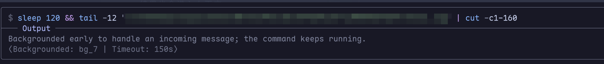

- **websearch**：二十多个搜索后端的调用顺序，随你拖拽微调。

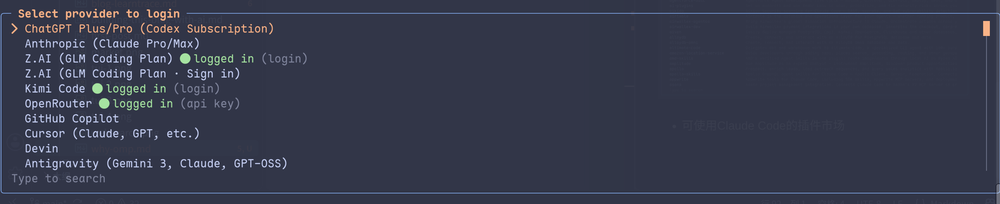

- **Pi 生态**：兼容大部分 Pi 生态，可安装 Pi 插件。

- **/marketplace**：可以直接浏览、安装 Claude Code 插件市场的插件。

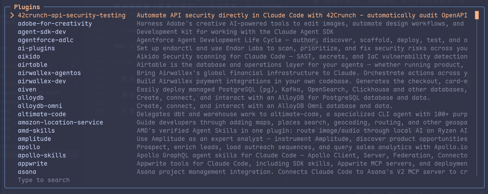

- **/model**：给 **smol、default、slow** 等角色分别指派模型（一共九个角色，plan、advisor、commit 等都有独立坑位），Subagent 的预设类型会默认从它们加载。

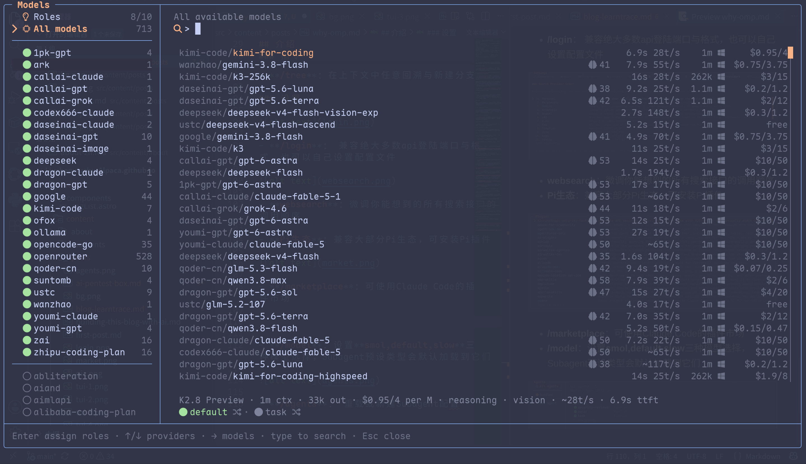

- **/agents**：重载或新建 Subagent 配置。

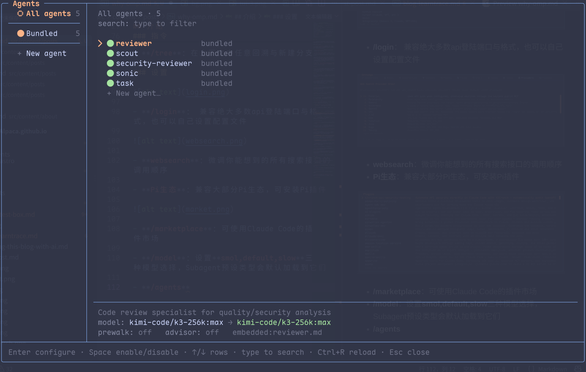

- **规则继承**：第一次启动就把别家写好的家当接过来——`.claude`、`.cursor`、`.codex`、`.windsurf` 等八种格式的规则、技能、MCP 服务器原样读取，没有迁移脚本，也没有“支持子集”的脚注。

- **回退链**：按角色或按模型配 fallback 链——主模型 429 或额度见底，下一个自动接完这一回合，冷却后恢复；一个提供商还能叠多把 key 轮询，单把 key 不至于午饭前就烧光。

- **路径作用域**：`enabledModels` 和 `disabledProviders` 可以按路径前缀生效——给某个仓库钉一套专属模型，全局配置不动分毫。

---

## 写在最后

这篇也只装得下这么多了，没展开的还有不少：`/handoff` 把会话交接进新上下文、`/stats` 打开本地用量仪表盘、技能系统按需加载方法论、MCP 服务器想接就接……更新也很勤，changelog 几乎天天见长。

真正打动我的总结起来大概是四件事：一是**信息明牌**——模型、价格、缓存、速率，请求一发就摆在屏幕上；二是**不设墙**——六十多家提供商随换，别家的规则文件、Claude Code 的插件市场、Pi 的插件，能继承的都继承，能兼容的都兼容；三是**开箱即用**——TUI、运行时、指令与设置，几乎不需要额外配置就能直接上手；四是**功能独特**——哈希行编辑、图压缩、/prewalk、Vibe、/tan……这些功能在别家 Agent 里都没有。

一个用起来顺手、能力别具一格、又不试图圈住你的 Agent，值得一试。

- 官网与文档：[omp.sh](https://omp.sh)
- 源码：[github.com/can1357/oh-my-pi](https://github.com/can1357/oh-my-pi)（MIT）
